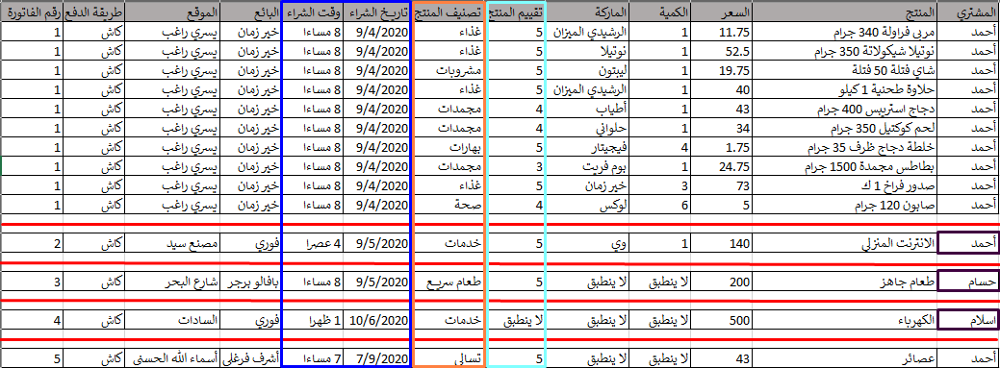
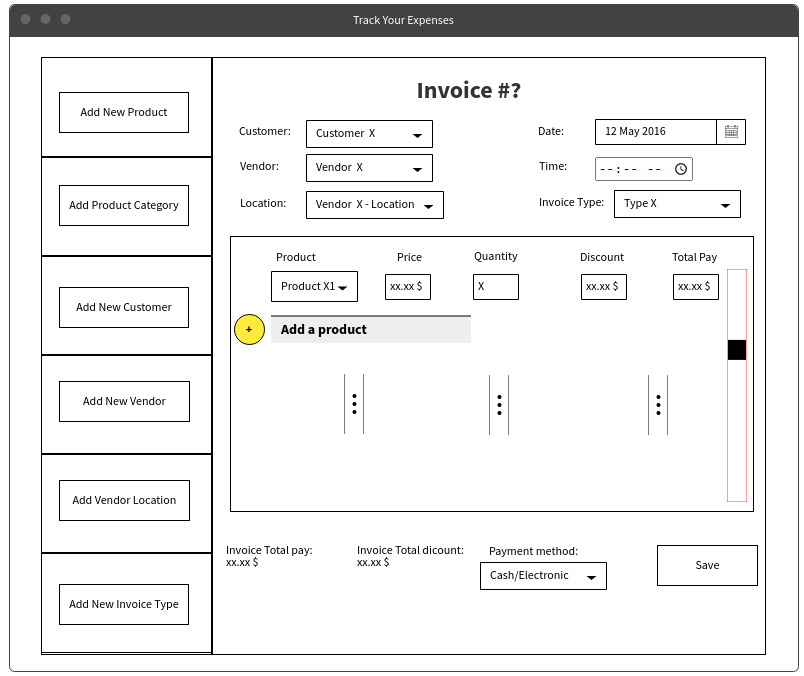
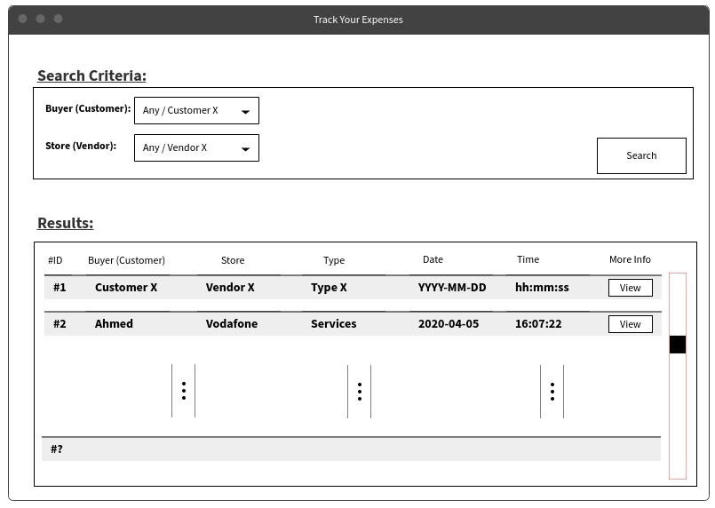

## Track Expenses
This repository is for a course project which is a Web Application this is interacting with a database designed to track and create reports about personal expenses for the database users.
___
**Table of Contents**:
|  |Description|
|--|--|
|**Overview**|The idea itself and how it lead to the creation of the project.|
|**ERD**|The Entity Relationship Diagram of the Database, which is the core of the project.|
|**Logical Model**|The actual tables in the database in the thrid form of Normalization.|
|**Prototypes**|Sketches for Website Desktop views.|
___
## Overview

This picture of many products that have been purchased at some time earlier contains very important data:
- Who have bought some product?
- When a product is purchased?
- How much did someone pay in a specific period of time.
- How much did someone pay at a specific type of product (Grocery? Fast Foods? Cleaning? other types?).
- Did someone pay to much for a useless product?

and many other useful questions that make the user aware of his expenses and where his money goes.
___
## ERD

___
## Logical Model (Compact)
Database tables reduced to the thrid form of normalization process
|#|Table|Attributes|Keys
|--|--|--|--|
|1|vendor|(**id**, name_)|PK: id|
|2|location|(**id**, **vendor_id**, address, city, address_notes)|PK: id|
| |               |                                                 |FK: vendor_id->vendor(id)|
|3|customer|(**id**, first_name, last_name, age, gender)|PK: id|
|4|category|(**id**, main_category, sub_category)|PK: id|
|5|product|(**id**, name_, trade_mark, **category_id**, weight_liter) |PK: id                       |
| |               |                                                   |FK: category_id->category(id)|
|6|customer_rating|(**customer_id**, **product_id**, rate, comments)|PK: (customer_id, product_id)                         |
| |               |                                                 |FK: customer_id->customer(id), product_id->product(id)|
|7|invoice_type|(**id**, type_)|PK: id|
|8|invoice|(**id**, **customer_id**, **vendor_id**, **location_id**, **invoice_type_id**, payment_date, payment_time, total_pay, payment_method)|PK: id                                              |
| |               |                                                                                       |FK: customer_id->customer(id), vendor_id->vendor(id), location_id->location(id), invoice_type_id->invoice_type(id)|
|9|invoice_item|(**invoice_id**, **product_id**, price, quantity, total_discount, total_pay)|PK: (invoice_id, product_id)                        |
| |               |                                                                         |FK: invoice_id->invoice(id), product_id->product(id)|
___
## Prototypes
Invoices Page

Reports Page

___
**Installations:**\
You only need a server to host the website files and database to connect to it.

One possible example is to use a program like AppServ or XAMPP.

**For AppServ:** paste the project inside the "www" folder inside the program directory.\
**For XAMPP:** paste the project inside the "htdocs" folder inside the program directory.

The database connection is established the same way in both programs by setting the username and password for the database during the installation process.
